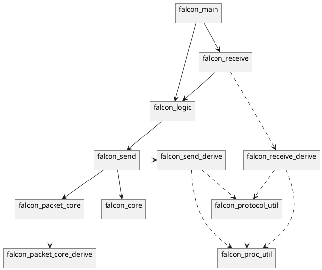

# Architecture

## Project Structure
`FalconMC` consists of many crates. These are found under the `crates` directory
in the root of the project. Important to note is that every crate name is always
the same as the name of the directory the crate is in but **with** a leading `falcon_`.

## List of crates

This is a listing of all the crates in falcon at the time of writing:

---

Crates that define the **core definitions**:

- **`falcon_core`**: This crate contains all the basic data definitions that are used throughout all of falcon.
    This includes block, location, configuration and schematic definitions.

- **`falcon_packet_core`**: This crate defines the base traits for serializing and deserializing data types according to the minecraft protocol.
  These are 6 traits with a design very similar to [serde](https://serde.rs).

Crates that define the **network protocols**:\
(Note that these crates may be better suited to be in a separate repository in the future):

- **`falcon_send`**: This crate exports a public interface (through the use of macros) that consists of
    one function per unique packet (based on the latest version). Internally, this crate deals with all
    the different packets and versions with *a lot* of macro magic while keeping things compact and elegant.

- **`falcon_receive`**: This crate exports a single function called `falcon_process_packet`.
    This function takes a protocol version, the actual bytes and a reference to `FalconConnection` (see below).
    The macros used in this crate appear almost identical as the ones used in `falcon_send` (see below).

Crates that define the **running behavior**:

- **`falcon_logic`**: This crate describes all the current behavior of the running process of the server.
    It drives the server loop and every connection's I/O.

Crates that define the **launch behavior**:

- **`falcon_main`**: This crate specifies what happens when the server launches.
    It loads the configuration file, loads the initial world, starts the server,
    starts listening for connections and launches a thread listening for console input.

Crates that define **macros**:

- **`falcon_proc_util`**: Utility crate for macro error handling.

- **`falcon_protocol_util`**: Utility crate exporting common structs used by both `falcon_receive_derive` and `falcon_send_derive`.

- **`falcon_packet_core_derive`**: Derive macros for the 6 traits defined in the `falcon_packet_core` crate.

- **`falcon_send_derive`**: Macro crate exporting an attribute macro used throughout all of the `falcon_send` crate.

- **`falcon_receive_derive`**: Macro crate exporting an attribute macro used throughout all of the `falcon_receive` crate.

## Crate dependency graph

---

The dashed lines refer to proc-macro crates.

