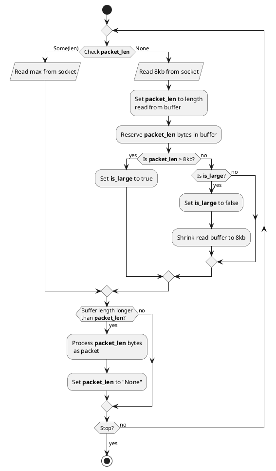
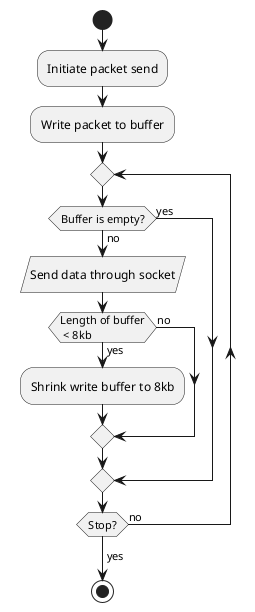

# Networking

## Packet pipeline

To guarantee performance, the packet pipeline should be one of the most optimized components of FalconMC.

### Receiving process
Shown below is a flowchart of the receiving end of a connection:

The theoretical maximum size of a packet seems to be 2 MB (maximum size that fits a 3-byte varint).
Achieving such a packet appears to be ultimately rare and because of that
it doesn't seem wise to just let buffers grow indefinitely. This approach keeps the size
of the buffers just right.

**Note**: After a packet has been processed, the raw bytes of that packet **must** be dropped.
Doing so will minimize the amount of reallocations required.

### Sending process
Shown below is a flowchart of the sending end of a connection:

Like receiving (see above), the maximum size of a packet is about 2 MB. This approach keeps the size of the buffers just right.

